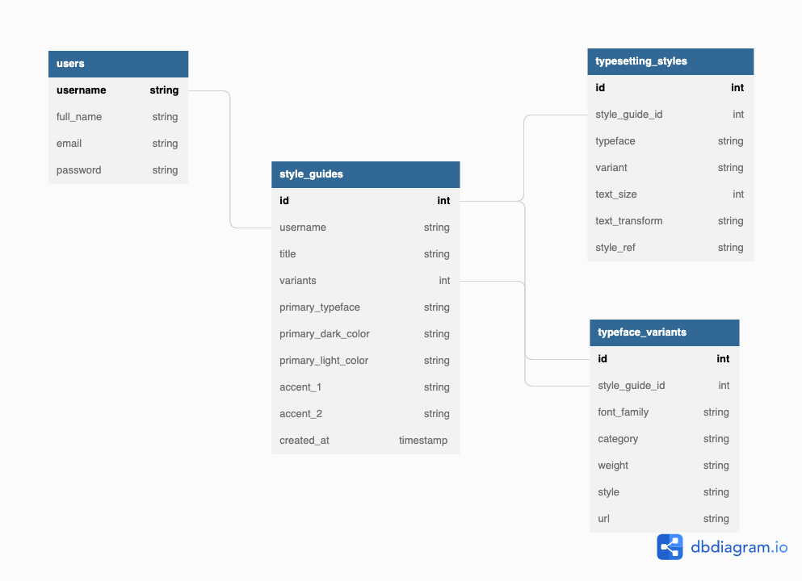
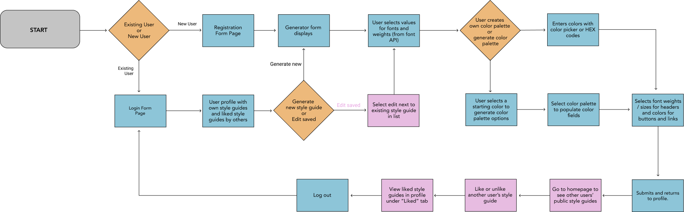
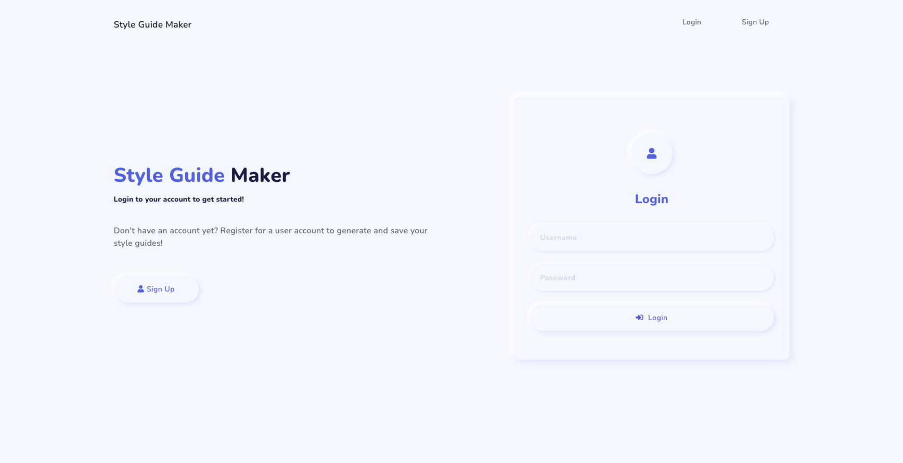
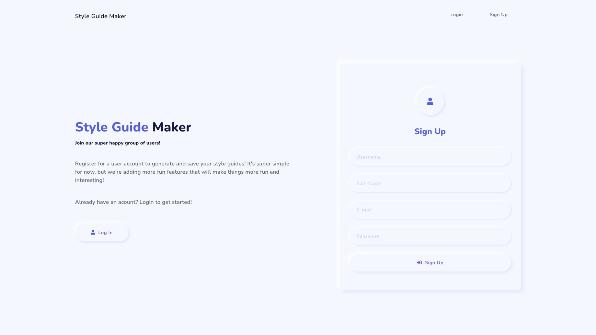
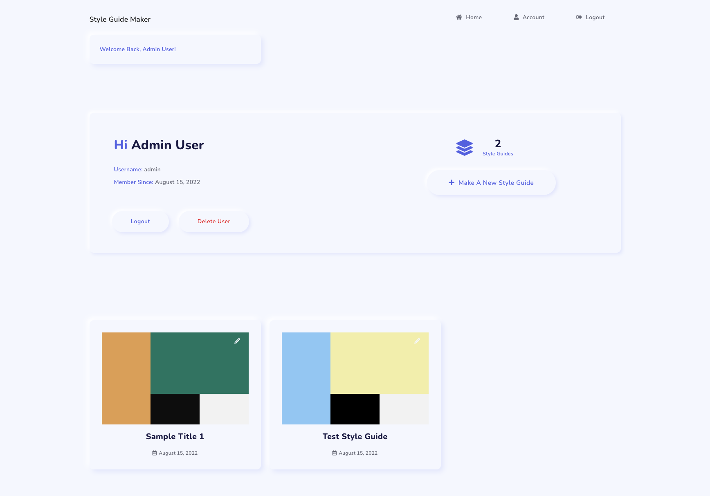
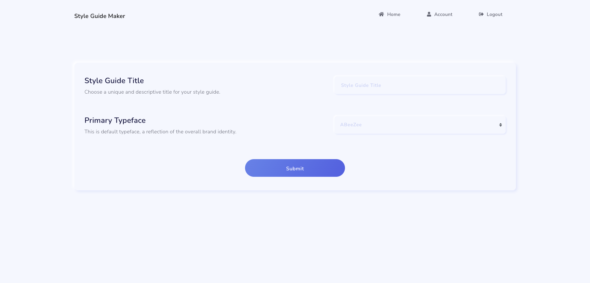
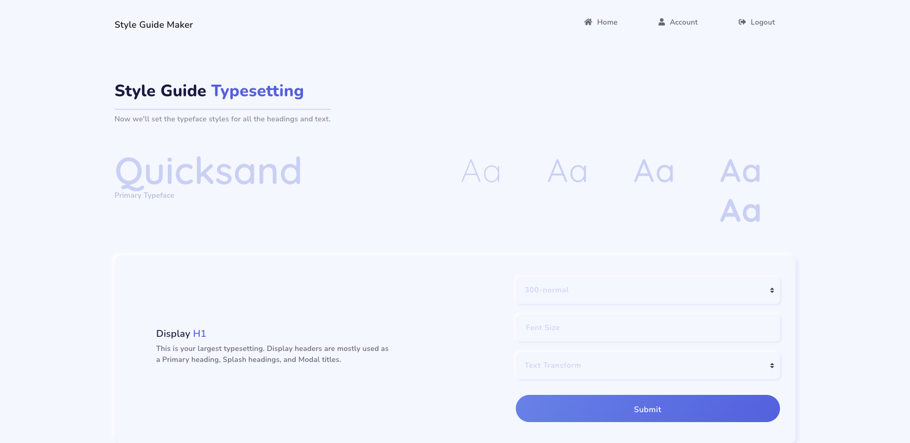
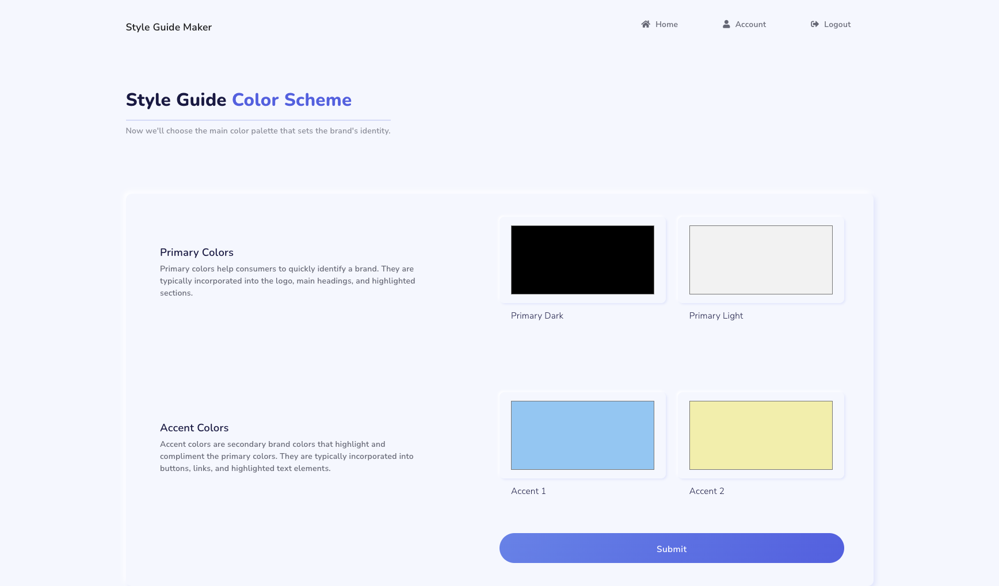
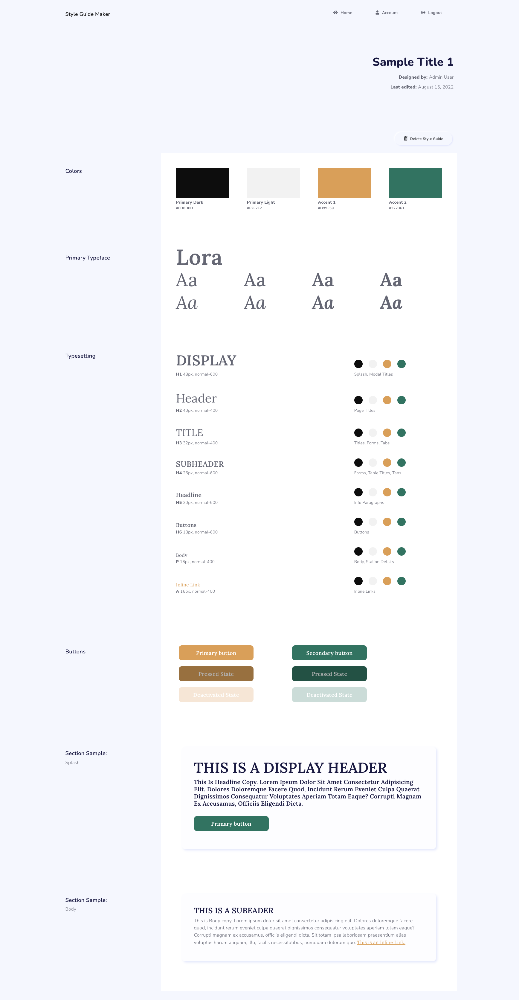

# Capstone One

### Style Guide Generator

[on Heroku](https://sasha-capstone-1.herokuapp.com/login)

------

When creating initial style guides, designers are often reusing the same base templates using their project's brand specs. A lot of times these start as a fluid proccess, to see how the brands color schemes and styles work together before proceeding with the rest of the brand design. The goal of this app is to automate the process, generating a simple, editable style guide using their brand's color scheme, organizing font styles by their use, and displaying key styling requirements to guide designers in the rest of the branding process. 

------

#### Key Features

* Login existing User
* Register new User
* Delete own account
* Choose a Primary Typeface for style guide from all available fonts on the Google Fonts API
* Select typesetting styles and weights for each header style from  styles and weights available within the chosen Primary Typeface
* Use a color piker to choose brand's primary and accent colors, or type in HEX or RGB references codes
* Usser can view all style guides they made through their user profile page
* User can delete a style guide they made

------

#### API Info

The [Google Fonts API](https://developers.google.com/fonts/docs/developer_api) will be used to search font families and can display all variations of a brand's font style the user. The font styles can be applied to their style guides based on the brand's requirements for headers, paragraphs, buttons and links. 

**Furthur Study**

The [Colormind API](http://colormind.io/api-access/) Can generate a brand's color palette based on a single or multiple color selection, or can generate a random color palette that the user can apply to their brand guidelines template.

------

#### Database Schema

------

#### User Flow

------

#### Security

User accounts with hashed passwords will allow users to safely save the style guides they create. Ideally users will have the option to share or hide/make private  style guides that they choose. 

Registered users will only be able to see usernames and public/shared style guides of other users. They won't be able to see email address or first/last name. First and last name will be optional fields when signing up.

Any user can see the homepage showing public/shared style guides, but only registered / logged in users will be able to: 

* Click on / view style guide details
* Like / save style guides by other users
* See usernames associated with public style guides
* Create / save a style guide

------

#### Potential Issues

* Users may not be familiar with the font names from the Google Font API. Since there is no preview option yet, they would have to know the name of the font they want to use before starting the style guide.
* Users cannot make changes to a style guide while building one - ie. they cannot change their primary typeface while generating their typesetting styles. 
* Users may run into issues when they want to reuse an existing color palette for a new style guide. The table schema isn't set up yet to anticipate this - future improvements will separate color palettes into their own table before adding to the style guide table. Will also need to work out how the user can access previously generated color palettes in the user flow. 

------

#### Future Improvements

* Responsive layout for Mobile
* Users should be able to make adjustments to color schemes and already generated style guides. Right now, the only option is to create a new style guide or delete existing style guides. 
* Users should be able to move forward and backward through the style guide generating forms, in case they need to make changes as they go. 
* Would like users to be able to preview fonts before selecting a primary font for their style guide - in case they are still in the exploring stage of the brand's development.
* Would want to add on a color palette generating API to give users the option of developing / generating color palettes separately, and later adding them to their style guides.
* A filtering feature on the homepage would be nice, so users can view all public style guides by popularity (most likes), by color palette, or by font family / style.
* Would want to add a social aspect, where users can choose to share their creations with other registered users or make them private. Ideally the community of users can browse style guides by other users, and  "favorite" those that they want to use as inspiration. 

------

#### Screenshots

##### 

*Login*

*Register*

*User Profile*

*Start New Style Guide*

*Set Typesetting Styles*

*Set Color Scheme*

*Sample Generated Style Guide*

