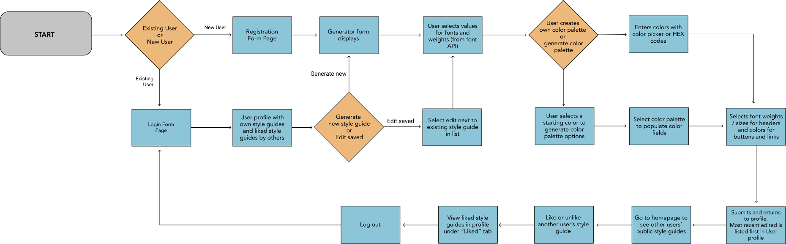

# Capstone One

### **Project Proposal:** Style Guide Generator

------

When creating initial style guides, designers are often reusing the same base templates and replicating using their project's brand specs. A lot of times these start as a fluid proccess, to see how the brands color schemes and styles work together before proceeding with the rest of the brand design. The goal of this app is to automate the process, generating a simple, editable style guide using their brand's color scheme, generating new color schemes, organizing font styles by their use, and displaying key styling requirements to guide designers in the rest of the branding process. Users will be able to make adjustments to color schemes and already generated style guides, and choose to share their creations or make them private. The community of users can browse  style guides by other users, and and "favorite" those that they want to use as inspiration. 

------

#### API Info

The [Google Fonts API](https://developers.google.com/fonts/docs/developer_api) will be used to search font families and can display all variations of a brand's font style the user. The font styles can be applied to their style guides based on the brand's requirements for headers, paragraphs, buttons and links. 

The [Colormind API](http://colormind.io/api-access/) Can generate a brand's color palette based on a single or multiple color selection, or can generate a random color palette that the user can apply to their brand guidelines template.

------

#### Database Schema

------

#### User Flow

------

#### Security

User accounts with hashed passwords will allow users to safely save the style guides they create. Ideally users will have the option to share or hide/make private  style guides that they choose. 

Registered users will only be able to see usernames and public/shared style guides of other users. They won't be able to see email address or first/last name. First and last name will be optional fields when signing up.

Any user can see the homepage showing public/shared style guides, but only registered / logged in users will be able to: 

* Click on / view style guide details
* Like / save style guides by other users
* See usernames associated with public style guides
* Create / save a style guide

------

#### Potential Issues

Users may run into issues when they want to reuse an existing color palette for a new style guide. The table schema is set up to anticipate this by separating color palettes into their own table before adding to the style guide table. Will need to work out how the user can access previously generated color palettes in the user flow. 

------

#### Stretch Goals

Would  like users to be able to adjust a color palette by individual color once generated, without having to regenerate a new palette. 

A filtering feature on the homepage would be nice, so users can view all public style guides by popularity (most likes), by color palette, or by font family / style.
